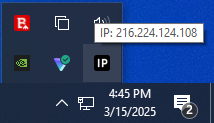
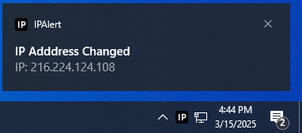
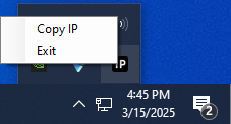

# IPAlert

A lightweight Windows system tray application that displays your **Public IP address** in the notification area. It will trigger application notifications if your IP Address changes or if you lose connection.

## Features
- **Shows Public IP Address** in the system tray.
- **Real-time Notifications** when your connection changes
- **Quickly Copy** your IP Address to the clipboard 

## Images
IP Address on hover:

IP Address Changed notification:

Connection Lost notification:

Right click options:

## Configuration
The ./Settings/appsettings.json file contains configuration settings. You must restart the app to refresh changes to the settings file.
- **NotificationsEnabled**: If true will enable notifications on IP address changes. If false, it will not show notifications.
- **NotificationTimeMs**: The time in milliseconds that the notification will display.
- **Mode**: Either "Timed" or "Auto". Timed mode polls the IP Address at regular interval. Auto mode responds to network change events.
- **PollingTimeMs**: The time in milliseconds between polls in Timed mode. Should be at least 1000 (1 second) to avoid throttling.

## Logs
Logs are stored in the ./Logs/ folder. The logs are rolled over daily and retained for 7 days. **No IP addresses, mac addresses, device Ids, or personal information is stored in the logs.**  

## Dependencies
- Windows 10/11
- [.NET 6.0+](https://dotnet.microsoft.com/en-us/download)
